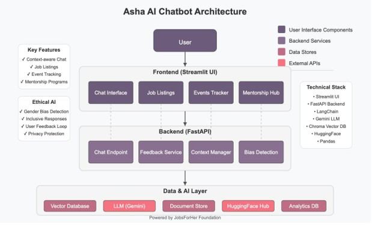
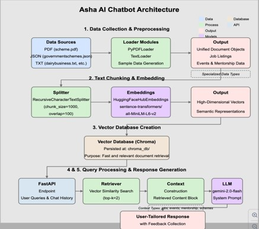
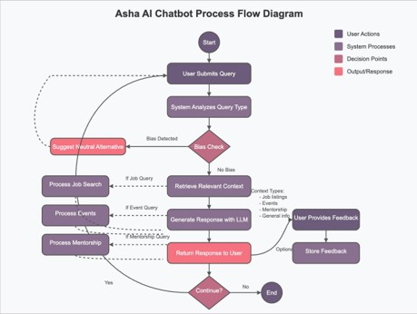
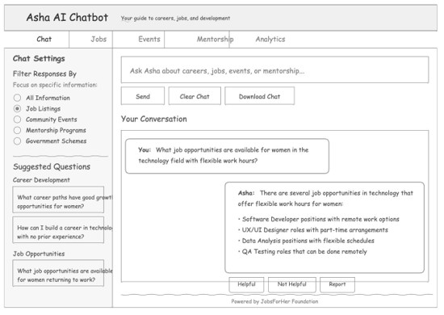
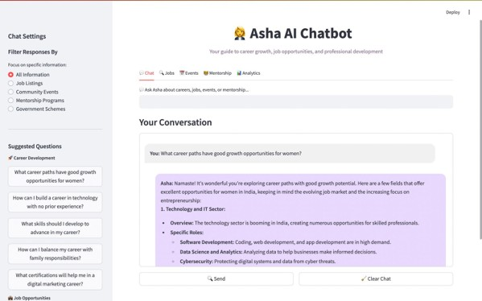
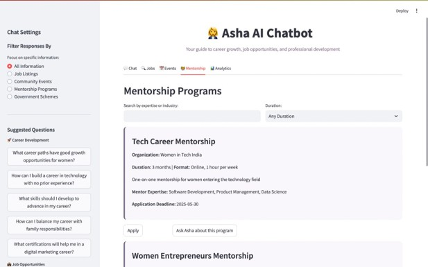

# 🌸 Asha AI Bot - Empowering Women Through Intelligent Conversations

> Built by **Team Sakhii** | ASHA AI Hackathon 2025  
> Organized by **JobsForHer Foundation** in collaboration with **Hack2skill**

---

## 🔥 Project Overview

**Asha AI Bot** is a women-centric, AI-powered chatbot developed to offer personalized assistance to rural Indian women in achieving financial independence and career empowerment. It provides guidance on:

- 💼 Job Opportunities
- 🎓 Mentorship Programs
- 📅 Event Tracking
- 📘 Financial & Business Literacy

The chatbot is built with ethical AI principles, ensuring private, inclusive, and bias-free interactions.

---

## 🧠 Core USPs

- 🧾 **Bias-Aware Responses**: Identifies and neutralizes gender-biased language.
- 🔁 **Contextual Conversations**: Maintains conversation history for natural, multi-turn flows.
- 📡 **Real-Time Knowledge Base**: Integrates with public APIs and structured datasets for up-to-date responses.
- 🛡️ **Ethical & Private**: Adheres to global AI ethics and privacy frameworks.
- 🌍 **Women-Centric**: Tailored to address specific challenges and opportunities for women.

---

## 🧩 Tech Stack

| Layer | Technology |
|-------|------------|
| Frontend | Streamlit |
| Backend | FastAPI |
| AI/NLP | LangChain, Google Gemini, Hugging Face Transformers |
| Data | Chroma Vector DB, CSV/JSON datasets |
| File Support | PyPDFLoader |
| Analytics | Custom Feedback DB |
| Bias Detection | Hugging Face + NLP filters |

---

## 🛠️ Architecture Diagram




## 🛠️ Process Flow



## 🛠️ User Case Diagram


### Wireframe/Prototype



### Snapshots of Prototype





---

## 🔄 System Flow (Text-based)

User submits a query  
→ Bias Detection  
 → If biased → Suggest neutral response  
 → If clean → Proceed to context retrieval  
→ Retrieve context using Vector DB (RAG)  
→ Generate response using Gemini LLM  
→ Return response to user  
→ Collect user feedback  
→ Improve model over time


---

## 📈 Performance Metrics

- ⚡ **<5 sec** average response time
- 🎯 High accuracy and relevance via semantic search
- 🔄 Context maintained through LangChain sessions

---

## 📚 Features Summary

- 🤖 Multi-turn Conversational AI (LangChain + Gemini)
- 📄 Document Ingestion (PDF, JSON, TXT)
- 🔍 Semantic Search (Hugging Face + Chroma DB)
- 🧠 Custom System Prompts (Culturally Aware)
- 🌐 Public API Integration (Jobs, Events, Mentorships)
- 🔐 Encrypted Data & Privacy Protection

---

## 🖼️ UI Screens

- Chat Tab (Main Interface)
- Job Listings Tab
- Events Tracker Tab
- Mentorship Hub Tab

> Add screenshots in the `assets/` folder with filenames `chat-interface.png`, `job-tab.png`, `event-tab.png`

---

## ⚙️ Installation & Setup

```bash
git clone https://github.com/your-repo/asha-ai-bot.git
cd asha-ai-bot
pip install -r requirements.txt
```

Set your environment variables:

```bash
export HUGGINGFACE_HUB_API_TOKEN=your_token
export GEMINI_API_KEY=your_api_key
```

Run the app:

```bash
uvicorn main:app --reload
```

---

## 📂 API Endpoint

### POST `/`

```json
{
  "query": "Your question here",
  "chat_history": [
    {"role": "user", "content": "Previous user message"},
    {"role": "assistant", "content": "Previous assistant response"}
  ]
}
```

---

## 📹 Demo & Links

- 🔗 GitHub Repo: [Insert Link]
- 📺 Demo Video: [Insert Link]

---

## 📍 Roadmap

- ✅ Hindi + English Text Support
- ✅ Feedback Loop Integration
- 🔜 Offline Kiosk Mode
- 🔜 Voice Query Support
- 🔜 NGO White-labeled Version

---

## 👥 Team Sakhii

- 👩‍💻 Ananya Gupta
- 🤖 Devanshi Jaiswal
- 📊 Aditi Singh
- 🎨 Aditi Jain

---

## 📜 License

Licensed under MIT. Free to use and modify for social impact and NGO deployment.

---

> _Created with passion to empower women through inclusive and ethical AI at ASHA AI Hackathon 2025._
